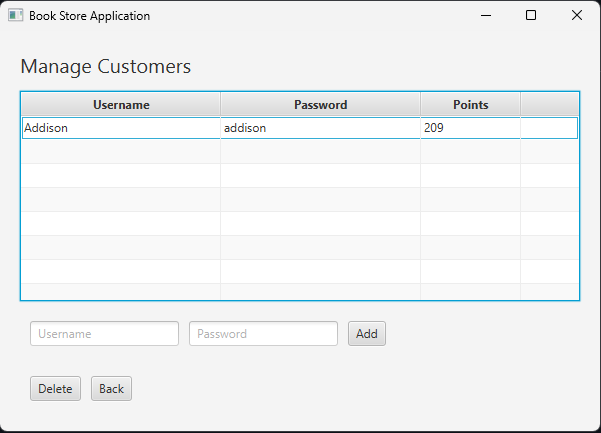

# Bookstore Management System

A comprehensive bookstore management application built with Java and JavaFX, featuring separate interfaces for store owners and customers with login authentication.

## Download

**[Download the latest release](https://github.com/minjii1079/bookstore-management-system/releases/latest)**

Extract the zip file and run `BookstoreManagementSystem.exe`.

## Features

### Owner Interface
- **Book Management**: Add, edit, and remove books from inventory
- **Customer Management**: View and add customer accounts
- **Inventory Tracking**: Monitor stock and book details

### Customer Interface
- **Book Shopping**: Browse and purchase books from the store
- **Loyalty Program**: Earn points with purchases to upgrade membership tier and use towards future purchases
- **Tiered Membership**: Progress from Silver to Gold tier for exclusive benefits
- **Secure Authentication**: Login system to protect customer accounts

## Technologies Used

- **Java**: Core programming language
- **JavaFX**: GUI framework for the user interface
- **Java I/O**: File handling and data persistance

## Screenshots

### Login Screen

### Owner Menu

### Customer Management

### Book Management

### Customer Shopping Interface

## Usage
### Owner Login

- Access the owner interface to manage inventory and customer data
- Add new books with details like title, author, price, and quantity
- View customer information and purchase history

### Customer Login

- Browse available books in the store
- Add items to cart and complete purchases
- Earn points with each purchase
- Track your membership tier and points balance

## Team
This project was developed as a collaborative effort by a team of 3 developers for the final project of Software Systems (COE318).

## Installation & Setup Requirements

### Dependencies
- Java Development Kit (JDK) 17
- JavaFX 17
- An IDE (NetBeans recommended)
